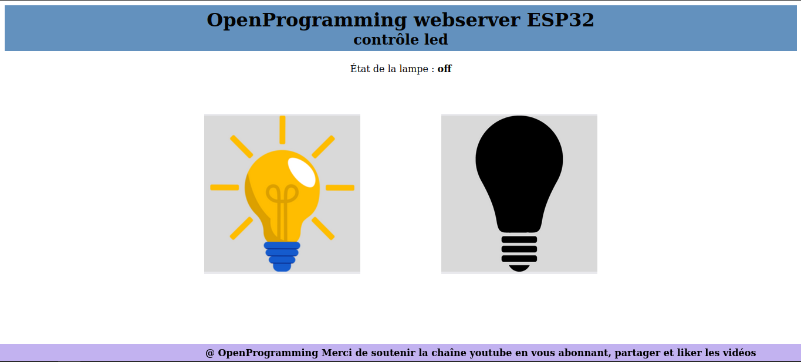

# Créer une serveur ESP32

# Board : ESP32

Ce code permet de contrôler une LED en utilisant une page web.
Si l'ESP32 est connecté à un réseau WiFi, la LED intégrée à l'ESP32 clignote régulièrement 
pour indiquer que la connexion est active. Si la connexion est perdue, l'ESP32 tente de se 
reconnecter automatiquement. 
 
*Le code est composé de plusieurs fichiers, 
+ Un fichier HTML qui contient la page web, 
+ Un fichier CSS pour la mise en forme, 
+ Un fichier JavaScript pour la gestion des événements
+ Deux photos qui sont utilisées comme images de fond.

*Bibliothèques nécessaires pour réaliser ce projet:
 + https://github.com/me-no-dev/ESPAsyncWebServer
 + https://github.com/me-no-dev/AsyncTCP

*Plugin : extension a installer sur l'IDE arduino pour le transfert des fichiers dans la mémoire flash.
 + https://github.com/me-no-dev/arduino-esp32fs-plugin/releases/  

*Image associées au site web

+

+

+
